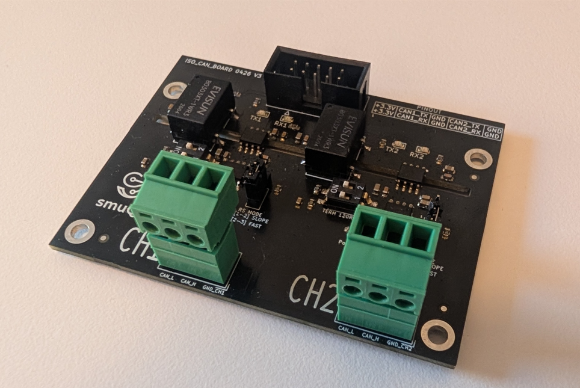

# ISO-CAN Dual Bus Stress Test

A high-performance CAN bus stress test application for ESP32-C6 with dual independent TWAI (Two-Wire Automotive Interface) nodes operating at **1 Mbps** bus speed.




## Overview

This project tests the stability and error recovery capabilities of dual CAN buses under continuous transmission and reception loads. It includes:

- **Dual CAN Bus Support** - Two independent TWAI nodes running simultaneously
- **Bi-directional Communication** - Each node transmits and receives frames
- **Real-time Monitoring** - Per-second statistics on message rates and error counts
- **Automatic Bus Recovery** - Dedicated recovery tasks for BUS-OFF error handling
- **High-Speed Operation** - 1 Mbps bitrate on both buses

## Hardware Configuration

### Pin Assignments

| Function | GPIO | CAN Node |
|----------|------|----------|
| CAN1 TX  | 13   | Node 1   |
| CAN1 RX  | 12   | Node 1   |
| CAN2 TX  | 11   | Node 2   |
| CAN2 RX  | 10   | Node 2   |

**Note:** Connect CAN transceiver modules to these GPIO pins. Typical connection:
- GPIO TX → Transceiver TX input
- GPIO RX → Transceiver RX output

## Architecture

### Task Structure

```
app_main()
├─ recovery_task(REC1) ............. Monitor Node 1 for BUS-OFF, auto-recover
├─ recovery_task(REC2) ............. Monitor Node 2 for BUS-OFF, auto-recover
├─ monitor_task(MON) ............... Collect and display statistics per second
├─ tx_task_node1(TX1) .............. Continuously transmit frames on Node 1
└─ tx_task_node2(TX2) .............. Continuously transmit frames on Node 2
```

### Message Flow

**Node 1:**
- Transmits: ID `0x111` with 8 bytes: `[0x1A, 0x1B, 0x1C, 0x1D, 0x01, 0x02, 0x03, 0x04]`
- Receives: Frames from Node 2 via CAN bus
- Queue: 100-message depth

**Node 2:**
- Transmits: ID `0x222` with 8 bytes: `[0x2A, 0x2B, 0x2C, 0x2D, 0x05, 0x06, 0x07, 0x08]`
- Receives: Frames from Node 1 via CAN bus
- Queue: 100-message depth
- Startup delay: 5ms (to prevent synchronization artifacts)

## Features

### Real-Time Statistics

The monitor task logs every second:
```
I (1000) CAN_STRESS_TEST: N1 -> Rx: 1000 msg/s | TX Err: 0 | RX Err: 0
I (1000) CAN_STRESS_TEST: N2 -> Rx: 1000 msg/s | TX Err: 0 | RX Err: 0
```

Metrics tracked:
- **Rx**: Messages received per second
- **TX Err**: Transmit error counter
- **RX Err**: Receive error counter

### Automatic Recovery

Each CAN node has a dedicated recovery task that:
1. Detects BUS-OFF state via monitoring task
2. Initiates bus recovery sequence
3. Waits up to 500ms for recovery (CAN spec: 128 × 11 recessive bits)
4. Logs recovery status

Recovery sequence:
```
W (5000) CAN_STRESS_TEST: Node 1 BUS-OFF detected, starting recovery...
I (5100) CAN_STRESS_TEST: Node 1 recovery complete.
```

### ISR-Based Message Reception

Messages are received via interrupt callbacks and queued immediately:
- Minimizes ISR latency
- Non-blocking reception in monitor task
- Suitable for high-throughput scenarios

## Building and Running

### Prerequisites

- ESP-IDF v6.0 or later
- ESP32-C6 development board
- CAN transceivers (e.g., MCP2551, TJA1050)
- USB cable for flashing/monitoring

### Build

```bash
idf.py build
```

### Flash

```bash
idf.py flash
```

### Monitor Output

```bash
idf.py monitor
```

Expected output:
```
I (0) cpu_start: App startup complete
I (100) CAN_STRESS_TEST: Hardware initialized. Starting 1 Mbps Stress Test...
I (1000) CAN_STRESS_TEST: N1 -> Rx: 1000 msg/s | TX Err: 0 | RX Err: 0
I (1000) CAN_STRESS_TEST: N2 -> Rx: 1000 msg/s | TX Err: 0 | RX Err: 0
```

## Configuration

### Transmission Parameters

Located in `tx_task_node1()` and `tx_task_node2()`:

```c
twai_frame_t frame = {
    .header = {
        .id = 0x111,           // CAN ID
        .dlc = 8               // Data Length Code (bytes)
    },
    .buffer = data,            // 8-byte data payload
    .buffer_len = 8
};
```

**Transmission Timing:**
- Queue timeout: 200ms per frame
- If transmission fails, task waits 50ms before retrying

### Bus Speed

Configured in `twai_system_init()`:

```c
.bit_timing = { .bitrate = 1000000 }  // 1 Mbps
```

To change bitrate, modify this value (e.g., `500000` for 500 kbps).

### Queue Sizes

```c
rx_queue1 = xQueueCreate(100, sizeof(can_msg_t));  // 100-message queue
rx_queue2 = xQueueCreate(100, sizeof(can_msg_t));
```

Increase if seeing queue overflows in monitor output.

## Troubleshooting

### No Messages Received

1. **Check GPIO connections** - Verify TX/RX lines connected to transceiver
2. **Check transceiver power** - Ensure CAN transceiver has power
3. **Check CAN bus termination** - Add 120Ω terminators at each end of physical CAN bus
4. **Verify clock** - Monitor task should show `Rx: > 0 msg/s`

### High Error Counts

- **TX Err > RX Err**: Transmission failures, check bus load and timing
- **RX Err > 0**: Bit timing mismatch or electromagnetic interference
- **Frequent BUS-OFF**: Hardware issue or incorrect bus speed configuration

### BUS-OFF Not Recovering

Check monitor output for timeout messages:
```
E (5500) CAN_STRESS_TEST: Node 1 recovery timed out, still BUS-OFF.
```

This indicates severe bus issues. Verify:
- Physical CAN bus connections
- Termination resistors
- Transceiver functionality

## Performance Metrics

### Expected Results at 1 Mbps

| Metric | Expected Value |
|--------|-----------------|
| Throughput | ~1000 msg/s per node |
| TX Error Count | 0 (normal operation) |
| RX Error Count | 0 (normal operation) |
| Recovery Time | < 500ms per BUS-OFF event |

### Stress Test Duration

For long-term reliability testing:
- Run for minimum **24 hours** to verify stability
- Monitor error counts for gradual increase
- Reset board periodically to test cold start

## Message Format

### CAN Frame Structure

```
ISO 11898-1 Standard Frame:

┌─────────────────────────────────┐
│ SOF | ID | RTR | DLC | Data ... │
└─────────────────────────────────┘

Node 1 Payload:
[0x1A][0x1B][0x1C][0x1D][0x01][0x02][0x03][0x04]

Node 2 Payload:
[0x2A][0x2B][0x2C][0x2D][0x05][0x06][0x07][0x08]
```

**Frame Properties:**
- Type: Standard (11-bit ID)
- Format: Data Frame (not Remote)
- DLC: 8 bytes

## Development Notes

### Adding Custom Payloads

Modify the data arrays in transmission tasks:

```c
uint8_t data[8] = {/* your data here */};
```

### Adjusting Transmission Rate

Modify the queue timeout in transmit tasks:

```c
twai_node_transmit(node1_hdl, &frame, pdMS_TO_TICKS(200));  // 200ms timeout
```

Shorter timeout = faster transmission rate (but higher failure risk).

### Monitoring Specific Frames

Modify the monitor task to decode and display frame payloads:

```c
while (xQueueReceive(rx_queue1, &msg, 0) == pdTRUE) {
    printf("Node 1 RX: ID=0x%X, DLC=%d, Data=[", msg.id, msg.dlc);
    for (int i = 0; i < msg.dlc; i++) printf("%02X ", msg.data[i]);
    printf("]\n");
    count1++;
}
```

## References

- [ESP-IDF TWAI Driver](https://docs.espressif.com/projects/esp-idf/en/latest/esp32c6/api-reference/peripherals/twai.html)
- [ISO 11898-1 CAN Standard](https://en.wikipedia.org/wiki/CAN_bus)
- [ESP32-C6 Datasheet](https://www.espressif.com/sites/default/files/documentation/esp32-c6_datasheet_en.pdf)

## License

MIT License

## Support

For issues or questions, check:
1. ESP-IDF monitor logs for error messages
2. Physical CAN bus connections and termination
3. GPIO pin configuration matches hardware setup
